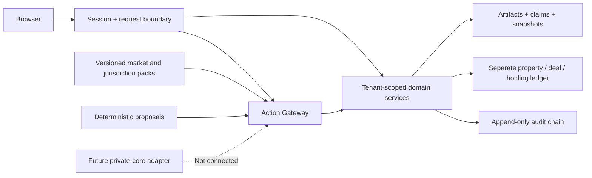

# Architecture and boundaries

The deployable unit is a standard-library Python HTTP application, a browser client, SQLite and versioned pack definitions. It is deliberately a local synthetic demonstrator. Business decisions live in `app/core.py` and `app/gateway.py`; browser controls are not authorization boundaries. SQL schema and immutability triggers live in `migrations/001_core.sql`.

The browser uses API projections. Public projection is an explicit field allowlist: property identity, marketing description, geography, asset type, units, asking price, synthetic marker and contributor attribution. Private room access requires the originating organization, reviewer/admin privilege or an explicit approved room grant. The reviewer is a trusted application-level role, not a legally licensed authority. Signup does not grant that role.

Evidence artifacts contain original accepted text and its hash. Numeric claims reference their artifact and line; intake claims identify structured intake. Confirmations are separate rows. Derived results never replace source claims. Underwriting snapshots freeze the evidence IDs, numeric inputs, assumptions, formula version, scenarios and results. Conflicting values remain simultaneously visible and block underwriting/publication until an independent reviewer records a reasoned selection of a confirmed nonlegal numeric claim. Reconciliation is append-only; a newly added claim invalidates the prior selection. The executor cannot determine legal priority.

`ActionProposal` records are persisted by the gateway for allowed and denied sensitive requests. Mutation uses a SQLite savepoint so a policy denial can preserve its audit trail without partial financial state. Agent envelopes carry no direct database-mutation authorization. Simulated subscriptions and distributions use integer cents and scoped idempotency keys. These entries represent demo participation only and do not prove legal ownership, settlement or custody.

The audit ledger chains event hashes and denies ordinary SQL update/delete operations with triggers. It supports integrity checking and inspection, not cryptographic non-repudiation against a database administrator. Full reconstruction of every database table solely from events, independent time-stamping and external immutable storage are not implemented.

The previous institutional network is a separate private data product. No actual organizations, professionals, mandates, outreach intelligence or private matching logic are imported into public fixtures. A future adapter must authenticate tenant and purpose, minimize fields, preserve sources and receive Action Gateway approval before disclosure or invitation. There is no automatic contact synchronization or outreach executor.
